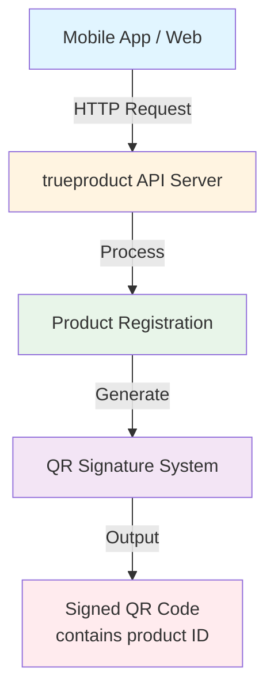

# 📦 trueproduct – Anti-Counterfeit Product Verification System (Go + Gin)

**trueproduct** is a high-performance backend service built with **Go + Gin**, designed to help companies prevent product counterfeiting. Manufacturers register products in a central system, and users verify product authenticity by scanning secure QR codes embedded with cryptographic signatures.

---

## 🚀 Features

- High-performance Go + Gin backend  
- Product registration API  
- QR code-based product verification  
- Modular architecture: controllers, services, repository  
- Production-ready folder structure  
- Easy deployment on Ubuntu/Linux  
- Planned support for HMAC/ECC signing and JWT auth  

---

## 📁 Project Structure

```
trueproduct/

├── cmd/
│   └── server/
│       └── main.go              # Entry point
├── internal/
│   ├── routes/                  # HTTP routes
│   ├── controller/              # Request handlers
│   ├── service/                 # Business logic (future)
│   ├── repository/              # Database access (future)
│   ├── utils/                   # Crypto & QR code utilities
│   └── config/                  # Environment & config
├── go.mod
└── go.sum
```

## 🧩 Architecture (High-Level)

### System Flow

```
┌─────────────────┐
│  Mobile App /   │
│     Web         │
└────────┬────────┘
         │
         │ HTTP Request
         ▼
┌─────────────────────────┐
│  trueproduct API Server │
│      (Go + Gin)         │
└────────┬────────────────┘
         │
         │ Process
         ▼
┌─────────────────────────┐
│  Product Registration   │
│  + QR Signature System  │
└────────┬────────────────┘
         │
         │ Generate
         ▼
┌─────────────────────────┐
│   Signed QR Code        │
│  (contains product ID) │
└─────────────────────────┘
```

### Mermaid Diagram



---

## 🛠 Installation (Ubuntu)

### 1. Install Go

```bash
wget https://go.dev/dl/go1.23.0.linux-amd64.tar.gz
sudo tar -C /usr/local -xzf go1.23.0.linux-amd64.tar.gz
echo 'export PATH=$PATH:/usr/local/go/bin' >> ~/.bashrc
source ~/.bashrc
```

### 2. Clone Repository

```bash
git clone https://github.com/yourname/trueproduct.git
cd trueproduct
```

### 3. Install Dependencies

```bash
go mod tidy
```

### 4. Run Development Server

```bash
go run cmd/server/main.go
```

**Server runs on:** `http://localhost:8080`

---

## 🧪 API Endpoints

### Health Check

**GET** `/health`

---

### Register Product

**POST** `/api/v1/trueproduct/register`

**Response:**

```json
{
  "service": "trueproduct",
  "message": "Product registered successfully"
}
```

---

### Verify Product by QR

**GET** `/api/v1/trueproduct/verify?qr=<qr_code_data>`

**Response:**

```json
{
  "service": "trueproduct",
  "valid": true,
  "qr": "example_qr_data"
}
```

---

## ▶ Production Deployment

### Build Binary

```bash
go build -o trueproduct cmd/server/main.go
```

### Run Binary

```bash
./trueproduct
```

---

## 🧷 Optional: Systemd Service (Linux Server)

Create service file `/etc/systemd/system/trueproduct.service`:

```ini
[Unit]
Description=TrueProduct API Service
After=network.target

[Service]
ExecStart=/home/ubuntu/trueproduct/trueproduct
Restart=always
User=ubuntu

[Install]
WantedBy=multi-user.target
```

Enable and start the service:

```bash
sudo systemctl daemon-reload
sudo systemctl enable trueproduct
sudo systemctl start trueproduct
```

---

## 🔐 Future Enhancements

- QR code signing using HMAC-SHA256 / ECC
- Unique fingerprint registration for products
- Duplicate QR scan detection
- JWT authentication for manufacturer portal
- PostgreSQL database integration

---

## 🤝 Contributing

Pull requests are welcome. For major changes, open an issue to discuss first.

---

## 📄 License

This project is licensed under the MIT License. See the LICENSE file for details.
